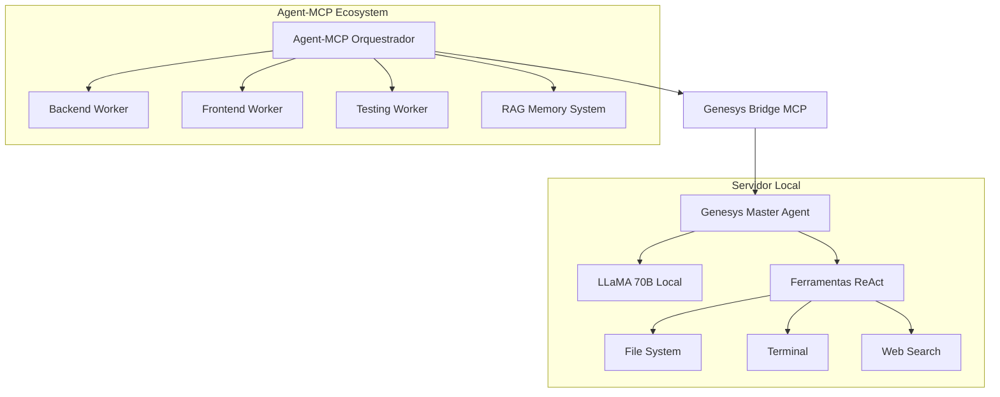

# 🤖 Integração Genesys + Agent-MCP

**Sistema Integrado de IA Soberana com Orquestração Multi-Agente**

## 🎯 Visão Geral

Esta integração transforma sua **Genesys (LLaMA 70B)** em um **agente especialista master** dentro do ecossistema **Agent-MCP**, criando um sistema híbrido poderoso que combina:

- 🧠 **Genesys**: Modelo LLaMA 70B local com processamento de imagens
- 🔄 **Agent-MCP**: Orquestração multi-agente com protocolo MCP
- 🌉 **Bridge MCP**: Integração transparente entre os sistemas
- 📊 **Dashboard**: Monitoramento em tempo real

## 🚀 Como Funciona na Prática

### **Arquitetura do Sistema Integrado**



### **Fluxo de Trabalho Prático**

1. **👨‍💻 Usuário**: "Crie um sistema de autenticação completo"
2. **🧠 Agent-MCP**: Analisa e decompõe em tarefas especializadas
3. **🤖 Genesys Master**: Recebe tarefa complexa de coordenação
4. **⚡ Delegação**: Genesys coordena workers especializados:
   - **Backend Worker**: API endpoints + database
   - **Frontend Worker**: UI components + forms
   - **Testing Worker**: Unit tests + integration tests
5. **🔄 Coordenação**: Todos os agentes compartilham contexto via RAG
6. **📊 Monitoramento**: Dashboard mostra progresso em tempo real

## 🛠️ Instalação e Configuração

### **1. Setup Inicial**

```bash
# 1. Clone o projeto Agent-MCP (se não tiver)
git clone https://github.com/rinadelph/Agent-MCP.git
cd Agent-MCP

# 2. Execute o setup da integração
python setup_integration.py

# 3. Configure sua OpenAI API Key
# Edite o arquivo .env e adicione:
# OPENAI_API_KEY=sua-chave-aqui
```

### **2. Inicializar Sistema**

**Método 1 - Script Automático:**

```bash
# Windows
start_system.bat

# Linux/Mac
./start_system.sh
```

**Método 2 - Manual:**

```bash
python start_integrated.py
```

### **3. Verificar Funcionamento**

```bash
# Status da Genesys
curl http://127.0.0.1:8002/status

# Status do Agent-MCP
curl http://127.0.0.1:8080/

# Dashboard (browser)
http://127.0.0.1:3847
```

## 🎮 Como Usar o Sistema

### **Cenário 1: Desenvolvimento de Feature Completa**

**No Dashboard Agent-MCP:**

1. **Criar Projeto**:

   ```
   Tarefa: "Implementar sistema de chat em tempo real"
   ```

2. **Agente Master (Genesys)** analisa e cria plano:

   ```
   ✅ Análise: WebSocket + React + Node.js + Database
   ✅ Decomposição em tarefas especializadas
   ✅ Criação de workers especializados
   ```

3. **Workers Especializados** executam em paralelo:

   ```
   🔧 Backend Worker: WebSocket server + Socket.io
   🎨 Frontend Worker: Chat components + real-time UI
   🧪 Testing Worker: Integration tests + E2E tests
   ```

4. **Coordenação via RAG**:
   ```
   📚 Context shared: API schemas, component props, test cases
   🔄 Real-time sync: Changes propagated to all agents
   ```

### **Cenário 2: Análise e Review de Código**

**Via MCP Tools:**

```javascript
// No dashboard, usar ferramenta MCP
genesys_chat({
  prompt: "Revise este código React e sugira melhorias",
  context:
    "{'file': 'components/UserForm.tsx', 'framework': 'React+TypeScript'}",
  use_tools: true,
});
```

**Resposta da Genesys:**

```
🤖 Genesys Master:
Analisando UserForm.tsx...

🔍 PROBLEMAS IDENTIFICADOS:
1. Missing prop validation
2. No error boundaries
3. Uncontrolled inputs

🔧 USANDO FERRAMENTAS:
[file_system] Lendo arquivo completo...
[web_search] Buscando best practices React TypeScript...

✨ MELHORIAS SUGERIDAS:
[Código melhorado com comentários detalhados]

⚡ Processado em 2.3s
```

### **Cenário 3: Orquestração Multi-Agente**

```javascript
// Criar agente especializado
create_genesys_agent({
  agent_id: "python_expert",
  specialization: "python_backend",
  task: "Optimize database queries in Django application",
});

// Atribuir tarefa específica
assign_task_to_genesys_agent({
  agent_id: "python_expert",
  task: "Add caching layer to user authentication system",
  priority: "high",
});
```

## 🔧 Ferramentas MCP Disponíveis

### **Core Genesys Tools**

| Ferramenta           | Descrição                  | Exemplo                        |
| -------------------- | -------------------------- | ------------------------------ |
| `genesys_chat`       | Chat direto com Genesys    | Análise de código, arquitetura |
| `genesys_multimodal` | Processamento imagem+texto | Screenshots, diagramas, UI     |
| `genesys_status`     | Status do sistema          | Monitoramento, debugging       |

### **Orquestração de Agentes**

| Ferramenta                     | Descrição                  | Exemplo                           |
| ------------------------------ | -------------------------- | --------------------------------- |
| `create_genesys_agent`         | Criar agente especializado | Backend, Frontend, DevOps         |
| `assign_task_to_genesys_agent` | Atribuir tarefa específica | Implementar feature, corrigir bug |
| `list_genesys_agents`          | Listar agentes ativos      | Monitoramento, status             |
| `terminate_genesys_agent`      | Encerrar agente            | Limpeza, recursos                 |

### **Administração**

| Ferramenta             | Descrição         | Exemplo                 |
| ---------------------- | ----------------- | ----------------------- |
| `genesys_reload_model` | Recarregar modelo | Após updates, problemas |

## 📊 Monitoramento e Debugging

### **Dashboard Agent-MCP**

- **URL**: http://127.0.0.1:3847
- **Features**:
  - 📈 Gráfico de agentes em tempo real
  - 📋 Lista de tarefas ativas
  - 🧠 Status da memória RAG
  - 🔄 Logs de comunicação MCP

### **Genesys Status API**

- **URL**: http://127.0.0.1:8002/status
- **Informações**:
  ```json
  {
    "model_loaded": true,
    "gpu_enabled": true,
    "uptime": 1847.2,
    "specializations": ["coding", "multimodal", "orchestration"]
  }
  ```

### **Logs do Sistema**

```bash
# Logs da Genesys
tail -f genesys_integration/data/logs/genesys.log

# Logs do Agent-MCP
tail -f .agent/mcp_server.log

# Logs de integração
tail -f integration.log
```

## ⚡ Vantagens vs AutoGen

| Aspecto                | **AutoGen**            | **Agent-MCP + Genesys**      |
| ---------------------- | ---------------------- | ---------------------------- |
| **🧠 Memória**         | Limitada ao contexto   | RAG persistente infinito     |
| **🤖 Agentes**         | Persistentes, confusos | Efêmeros, especializados     |
| **⚡ Performance**     | Single-thread          | Multi-paralelo               |
| **🔧 Controle**        | Básico, rígido         | Granular, flexível           |
| **📊 Observabilidade** | Logs simples           | Dashboard completo           |
| **🔒 Segurança**       | Contexto exposto       | Compartimentalizado          |
| **🛠️ Ferramentas**     | Limitadas              | Genesys ReAct completo       |
| **🎯 Especialização**  | Agentes genéricos      | Agentes ultra-especializados |

## 🚨 Solução de Problemas

### **Genesys não inicia**

```bash
# Verificar dependências
python -c "import torch, transformers; print('OK')"

# Verificar modelo
ls -la genesys_integration/models/

# Logs detalhados
python start_integrated.py --debug
```

### **Agent-MCP não conecta**

```bash
# Verificar porta
netstat -an | grep 8080

# Testar MCP tools
curl http://127.0.0.1:8080/mcp/tools

# Reiniciar serviços
python start_integrated.py --restart
```

### **Dashboard não carrega**

```bash
# Verificar Node.js
node --version  # Deve ser >=18

# Instalar dependências
cd agent_mcp/dashboard && npm install

# Logs do dashboard
npm run dev --verbose
```

### **Modelo carrega devagar**

```bash
# Verificar GPU
nvidia-smi

# Usar modelo menor para testes
# No .env: MODEL_GGUF_FILENAME=llama-3-8b-instruct.Q4_K_M.gguf
```

## 🎯 Exemplos Práticos de Uso

### **Exemplo 1: Análise Completa de Projeto**

```python
# Via Python
import requests

response = requests.post("http://127.0.0.1:8002/chat", json={
    "prompt": """
    Analise este projeto Agent-MCP e:
    1. Identifique pontos de melhoria na arquitetura
    2. Sugira refatorações no código Python
    3. Proponha testes adicionais
    4. Documente APIs não documentadas
    """,
    "use_tools": True
})

print(response.json()['response'])
```

### **Exemplo 2: Geração de Código Multimodal**

```javascript
// Via Dashboard MCP Tools
genesys_multimodal({
  prompt: "Analise este mockup e gere o componente React correspondente",
  image_base64: "data:image/png;base64,iVBORw0KGgoAAAANSUhEUgAA...",
});
```

### **Exemplo 3: Orquestração para E-commerce**

```javascript
// Criar sistema de e-commerce completo
orchestrate_multi_agent_task({
  task: "Desenvolver plataforma de e-commerce com React + Node.js",
  required_specializations: [
    "react_frontend",
    "node_backend",
    "database_design",
    "payment_integration",
    "testing_automation",
    "devops_deployment",
  ],
});
```

## 🔮 Roadmap e Melhorias

### **Fase 1 - Atual ✅**

- [x] Integração básica Genesys + Agent-MCP
- [x] Bridge MCP funcional
- [x] Dashboard de monitoramento
- [x] Ferramentas ReAct integradas

### **Fase 2 - Próxima**

- [ ] Fine-tuning contínuo da Genesys
- [ ] Integração com Git workflows
- [ ] Agents persistentes por projeto
- [ ] Multimodal avançado (código + imagens)

### **Fase 3 - Futuro**

- [ ] Distribuição de agentes (múltiplas máquinas)
- [ ] Integração com Kubernetes
- [ ] Agentes especializados por linguagem
- [ ] Marketplace de agentes

## 📞 Suporte e Comunidade

- **🐛 Issues**: [GitHub Issues](https://github.com/rinadelph/Agent-MCP/issues)
- **💬 Discussões**: [GitHub Discussions](https://github.com/rinadelph/Agent-MCP/discussions)
- **📖 Docs**: Este arquivo + `/docs`
- **🎥 Demos**: `/examples` (em breve)

---

**🎉 Parabéns! Você agora tem o sistema de IA mais avançado rodando localmente!**

_Sistema desenvolvido para máxima autonomia, privacidade e performance._
