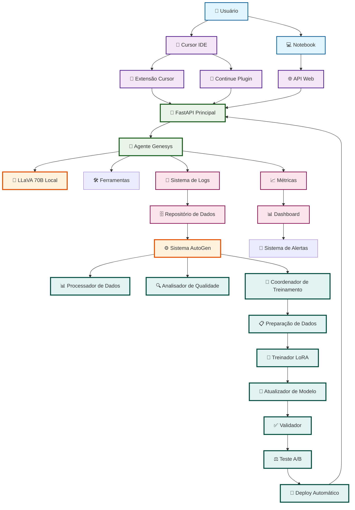
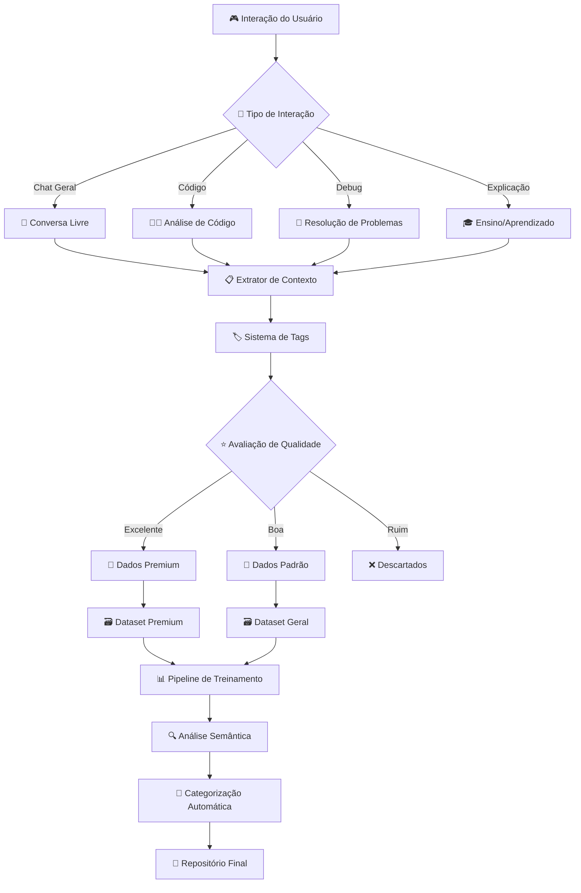
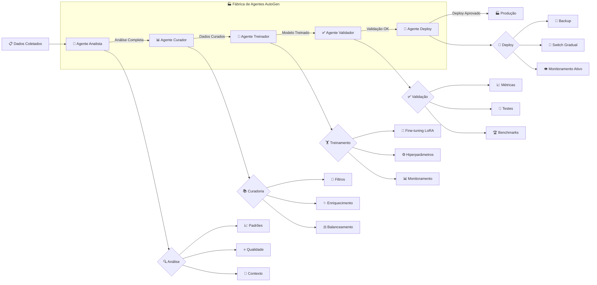
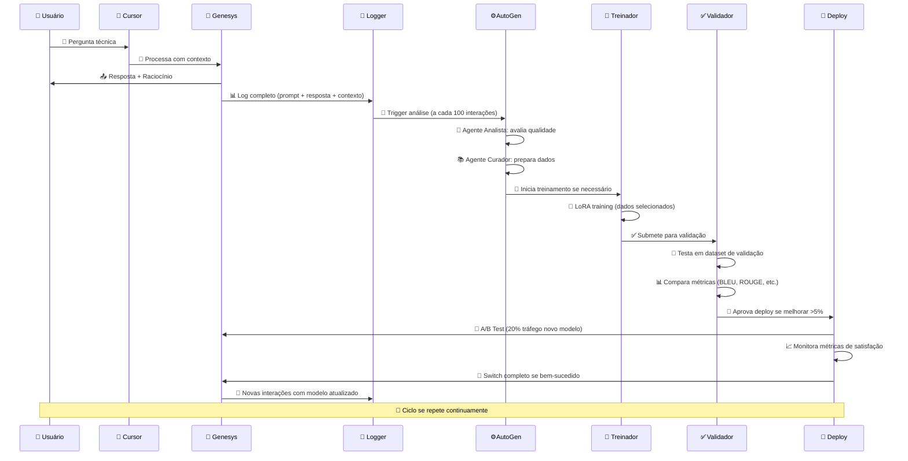
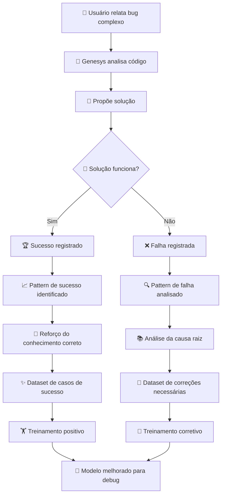
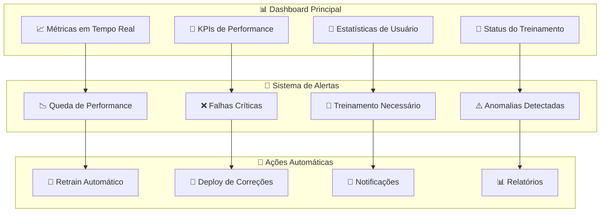

# 🧠 FLUXO COMPLETO DE TREINAMENTO GENESYS IA

## 🎯 **OBJETIVO PRINCIPAL**
Criar um sistema de aprendizado contínuo onde Genesys evolui com base nas interações reais, melhorando suas respostas, conhecimento de código e capacidades técnicas.

---

## 📊 **ARQUITETURA DE TREINAMENTO**



---

## 🔄 **FASES DO TREINAMENTO**

### **FASE 1: COLETA INTELIGENTE DE DADOS** 📊



### **FASE 2: SISTEMA AUTOGEN PARA TREINAMENTO** 🤖



### **FASE 3: PIPELINE DE MELHORIA CONTÍNUA** 🔄



---

## 🛠️ **IMPLEMENTAÇÃO PRÁTICA**

### **📁 ESTRUTURA DE DADOS**

```yaml
📂 data/
├── 📊 raw/                    # Dados brutos das interações
│   ├── 💬 conversations/      # Logs de chat
│   ├── 👨‍💻 code_analysis/      # Análises de código
│   ├── 🐛 debugging/          # Sessões de debug
│   └── 🎓 explanations/       # Explicações didáticas
├── 📋 processed/              # Dados processados
│   ├── ✨ curated/            # Dados curados e validados
│   ├── 🏷️ tagged/             # Dados com tags automáticas
│   └── ⚖️ balanced/           # Datasets balanceados
├── 🎯 training/               # Dados para treinamento
│   ├── 🏋️ train_set/         # Conjunto de treinamento
│   ├── ✅ validation_set/     # Conjunto de validação
│   └── 🧪 test_set/          # Conjunto de teste
└── 📈 metrics/                # Métricas e avaliações
    ├── 📊 performance/        # Performance do modelo
    ├── 👍 satisfaction/       # Satisfação do usuário
    └── 🎯 accuracy/           # Precisão das respostas
```

### **🔧 CONFIGURAÇÕES DE TREINAMENTO**

```python
# Configuração do Sistema de Treinamento Genesys
TRAINING_CONFIG = {
    "data_collection": {
        "log_all_interactions": True,
        "quality_threshold": 0.7,
        "context_window": 4096,
        "tag_categories": [
            "coding", "debugging", "explanation", 
            "architecture", "optimization", "testing"
        ]
    },
    
    "autogen_agents": {
        "data_analyst": {
            "model": "genesys-local",
            "specialization": "data_quality_analysis",
            "trigger_threshold": 100  # interações
        },
        "data_curator": {
            "model": "genesys-local", 
            "specialization": "dataset_preparation",
            "filter_criteria": ["relevance", "accuracy", "completeness"]
        },
        "trainer_agent": {
            "model": "genesys-local",
            "specialization": "model_training",
            "lora_config": {
                "rank": 16,
                "alpha": 32,
                "dropout": 0.1
            }
        },
        "validator_agent": {
            "model": "genesys-local",
            "specialization": "model_validation",
            "metrics": ["bleu", "rouge", "bertscore", "user_satisfaction"]
        }
    },
    
    "training_pipeline": {
        "batch_size": 4,
        "learning_rate": 2e-4,
        "epochs": 3,
        "gradient_accumulation": 8,
        "warmup_steps": 100,
        "evaluation_strategy": "steps",
        "eval_steps": 500,
        "save_strategy": "epoch",
        "logging_steps": 100
    },
    
    "quality_gates": {
        "minimum_improvement": 0.05,  # 5% melhoria mínima
        "validation_score_threshold": 0.8,
        "user_satisfaction_threshold": 0.85,
        "a_b_test_duration_hours": 24,
        "rollback_on_degradation": True
    }
}
```

---

## 🎯 **CASOS DE USO ESPECÍFICOS**

### **🧪 CENÁRIO 1: APRENDIZADO DE NOVO FRAMEWORK**

```mermaid
flowchart TD
    A[👤 Usuário pergunta sobre Vue 3] --> B[🤖 Genesys responde com conhecimento atual]
    B --> C[📝 Interação é logada]
    C --> D{🎯 Usuário corrige/complementa?}
    
    D -->|Sim| E[📚 Feedback é capturado]
    D -->|Não| F[✅ Resposta considerada adequada]
    
    E --> G[🏷️ Tag: "vue3_learning"]
    F --> H[🏷️ Tag: "vue3_confirmed"]
    
    G --> I[🔄 AutoGen detecta padrão de correções]
    H --> I
    
    I --> J[📊 Agente Analista identifica gap de conhecimento]
    J --> K[🎯 Busca automática por documentação Vue 3]
    K --> L[📋 Prepara dataset específico de Vue 3]
    L --> M[🔬 Fine-tuning focado em Vue 3]
    M --> N[✅ Valida com perguntas similares]
    N --> O[🚀 Deploy com conhecimento aprimorado]
```

### **🐛 CENÁRIO 2: MELHORIA EM DEBUG**



---

## 📊 **MÉTRICAS E MONITORAMENTO**

### **🎯 KPIs PRINCIPAIS**

| Métrica | Meta | Medição |
|---------|------|---------|
| **🎯 Taxa de Sucesso** | >90% | Respostas corretas/úteis |
| **⚡ Tempo de Resposta** | <5s | Latência média |
| **👍 Satisfação do Usuário** | >85% | Feedback direto |
| **🔄 Taxa de Aprendizado** | +5%/semana | Melhoria de performance |
| **🎓 Cobertura de Conhecimento** | >95% | Tópicos conhecidos |
| **🔧 Precisão Técnica** | >95% | Validação por especialistas |

### **📈 DASHBOARD DE MONITORAMENTO**



---

## 🚀 **ROADMAP DE IMPLEMENTAÇÃO**

### **📅 CRONOGRAMA DE DESENVOLVIMENTO**

| Fase | Duração | Entregáveis |
|------|---------|-------------|
| **🏗️ FASE 1** | 2 semanas | Sistema de logs estruturados + Pipeline básico |
| **🤖 FASE 2** | 3 semanas | Agentes AutoGen + Análise automática |
| **🔬 FASE 3** | 4 semanas | Sistema de treinamento LoRA + Validação |
| **🚀 FASE 4** | 2 semanas | Deploy automático + A/B Testing |
| **📊 FASE 5** | 1 semana | Dashboard + Monitoramento completo |

### **🎯 PRÓXIMOS PASSOS IMEDIATOS**

1. **📊 Implementar logging estruturado** nos endpoints existentes
2. **🤖 Configurar agentes AutoGen** para análise de dados
3. **🔬 Setupar pipeline de fine-tuning** com LoRA
4. **✅ Criar sistema de validação** automática
5. **🚀 Implementar deploy gradual** com rollback automático

---

## 💡 **BENEFÍCIOS ESPERADOS**

### **🎯 PARA O USUÁRIO**
- ✅ **Respostas mais precisas** baseadas em experiência real
- ✅ **Aprendizado contínuo** sobre suas preferências
- ✅ **Conhecimento específico** do seu domínio/projeto
- ✅ **Debugging mais eficaz** baseado em casos reais

### **🚀 PARA O SISTEMA**
- ✅ **Evolução automática** sem intervenção manual
- ✅ **Qualidade crescente** com cada interação
- ✅ **Especialização dinâmica** em áreas de uso frequente
- ✅ **Robustez aumentada** através de validação contínua

---

## 🔧 **IMPLEMENTAÇÃO NO NOTEBOOK**

### **📝 SCRIPT DE SETUP RÁPIDO**

```python
# 🚀 Script para iniciar o sistema de treinamento via notebook
def setup_training_system():
    """
    Configura o sistema completo de treinamento do Genesys
    para ser executado remotamente via notebook
    """
    
    # 1. Verificar conectividade com servidor
    # 2. Configurar agentes AutoGen
    # 3. Inicializar pipeline de dados
    # 4. Setupar monitoramento
    # 5. Ativar sistema de aprendizado
    
    return "Sistema de treinamento ativo! 🎯"
```

### **⚡ COMANDOS ÚTEIS**

```bash
# Iniciar sistema de treinamento
python scripts/start_training_system.py

# Monitorar progresso
python scripts/monitor_training.py

# Análise de dados coletados
python scripts/analyze_interaction_data.py

# Trigger treinamento manual
python scripts/manual_training_trigger.py
```

---

**🎯 Este sistema cria um Genesys verdadeiramente inteligente que evolui continuamente com base no uso real, tornando-se cada vez mais útil e especializado para suas necessidades específicas!**
