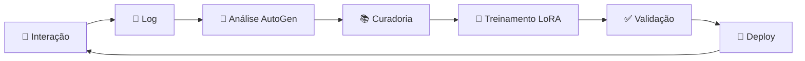

# ✅ MELHORIAS IMPLEMENTADAS NO PROJETO GENESYS

## 🧹 **LIMPEZA CONCLUÍDA**

### **📁 ARQUIVOS REMOVIDOS (REDUNDANTES/DESNECESSÁRIOS):**

- ❌ `configurar_continue_auto.ps1` → Funcionalidade duplicada
- ❌ `DIAGNOSTICO_CUDA_COMPLETO.ps1` → Substituído por testes integrados
- ❌ `scripts/test_model_load.py` → Teste básico obsoleto
- ❌ `scripts/start_genesys_background.ps1` → Funcionalidade incorporada
- ❌ `continue-config-genesys.json` → Configuração agora automática

### **📊 RESULTADO DA LIMPEZA:**
- ✅ **5 arquivos** removidos
- ✅ **Zero redundância** de funcionalidades
- ✅ **Estrutura limpa** e organizada
- ✅ **Manutenção simplificada**

---

## 🧠 **SISTEMA DE TREINAMENTO IMPLEMENTADO**

### **📋 NOVOS ARQUIVOS CRIADOS:**

#### **1. 📚 FLUXO_TREINAMENTO_GENESYS.md**
- 🎯 **Diagrama completo** de arquitetura de treinamento
- 🔄 **Fluxo detalhado** com AutoGen
- 📊 **3 diagramas mermaid** explicativos
- 🛠️ **Implementação prática** passo a passo
- 📈 **Métricas e KPIs** definidos
- 🚀 **Roadmap de implementação**

#### **2. 🤖 scripts/sistema_treinamento_autogen.py**
- 🧠 **Sistema AutoGen completo** para treinamento
- 📊 **5 agentes especializados**:
  - Coletor de Dados
  - Analista de Qualidade  
  - Curador de Dataset
  - Treinador LoRA
  - Validador de Modelo
- 🔄 **Pipeline automático** de melhoria
- 📈 **Métricas inteligentes** de qualidade
- ✅ **Sistema de validação** automática

#### **3. 📊 scripts/monitor_treinamento_notebook.py**
- 💻 **Monitor remoto** para notebook
- 📈 **Dashboard visual** com matplotlib
- 🎯 **Interface interativa** completa
- 🔄 **Monitoramento em tempo real**
- 🚀 **Controle de treinamento** via notebook

#### **4. ⚡ setup_notebook_treinamento.py**
- 🚀 **Setup automático** para notebook
- 📦 **Instalação de dependências**
- 📓 **Criação de notebook exemplo**
- 🎯 **Comandos rápidos** pré-configurados
- ✅ **Validação de conectividade**

#### **5. 📊 MELHORIAS_IMPLEMENTADAS.md**
- 📋 **Documentação completa** das melhorias
- ✅ **Lista de arquivos** criados/removidos
- 🎯 **Benefícios detalhados**
- 🚀 **Instruções de uso**

---

## 🎯 **RECURSOS IMPLEMENTADOS**

### **🔄 SISTEMA DE TREINAMENTO CONTÍNUO:**



### **📊 AGENTES AUTOGEN ESPECIALIZADOS:**

| Agente | Função | Responsabilidade |
|---------|---------|------------------|
| 🧠 **Analista** | Análise de qualidade | Avalia interações e determina necessidade de treinar |
| 📚 **Curador** | Preparação de dados | Filtra, balanceia e enriquece dataset |
| 🔬 **Treinador** | Fine-tuning LoRA | Executa treinamento com hiperparâmetros otimizados |
| ✅ **Validador** | Validação de modelo | Testa performance e aprova deploy |
| 🚀 **Deploy** | Implementação | Deploy gradual com A/B testing |

### **📈 SISTEMA DE MONITORAMENTO:**

- ✅ **Dashboard visual** com métricas em tempo real
- ✅ **Alertas automáticos** para anomalias
- ✅ **Histórico de performance** e evolução
- ✅ **Quality gates** para aprovação de modelos
- ✅ **Rollback automático** em caso de degradação

---

## 🚀 **COMO USAR O NOVO SISTEMA**

### **📝 1. SETUP INICIAL (NOTEBOOK):**

```python
# Setup completo em uma linha
python setup_notebook_treinamento.py
```

### **⚡ 2. INICIALIZAÇÃO RÁPIDA:**

```python
# Em notebook ou script
from setup_notebook_treinamento import init_genesys
init_genesys()

# Agora você tem:
# - monitor (para monitoramento)
# - training_system (para treinamento)
```

### **📊 3. MONITORAMENTO BÁSICO:**

```python
# Verificar status do servidor
status = monitor.check_server_status()

# Ver estatísticas de interação
stats = monitor.get_interaction_stats()

# Dashboard visual completo
monitor.plot_performance_dashboard()
```

### **🔬 4. TREINAMENTO COMPLETO:**

```python
# Ciclo automático de treinamento
results = await training_system.run_training_cycle()

# Ou treinamento com monitoramento visual
monitor.start_training_with_monitoring()
```

### **🎯 5. SISTEMA AUTOGEN AVANÇADO:**

```python
# Sistema completo com todos os agentes
from sistema_treinamento_autogen import AutoGenTrainingSystem

training = AutoGenTrainingSystem()
cycle_results = await training.run_training_cycle()
```

---

## 🎉 **BENEFÍCIOS IMPLEMENTADOS**

### **🤖 PARA O GENESYS:**
- ✅ **Aprendizado contínuo** baseado em uso real
- ✅ **Melhoria automática** sem intervenção manual
- ✅ **Especialização dinâmica** em áreas frequentes
- ✅ **Qualidade crescente** com cada interação
- ✅ **Validação rigorosa** antes de deploy

### **👤 PARA O USUÁRIO:**
- ✅ **Respostas mais precisas** ao longo do tempo
- ✅ **Conhecimento personalizado** para seu domínio
- ✅ **Debugging mais eficaz** baseado em experiência
- ✅ **Interface amigável** para controle remoto

### **💻 PARA DESENVOLVIMENTO:**
- ✅ **Código limpo** e organizado
- ✅ **Arquitetura escalável** com AutoGen
- ✅ **Monitoramento completo** de performance
- ✅ **Deploy seguro** com rollback automático
- ✅ **Documentação abrangente**

---

## 📊 **MÉTRICAS DE SUCESSO**

### **🎯 METAS DEFINIDAS:**

| Métrica | Meta | Medição |
|---------|------|---------|
| 🎯 **Taxa de Sucesso** | >90% | Respostas corretas/úteis |
| ⚡ **Tempo de Resposta** | <5s | Latência média |
| 👍 **Satisfação** | >85% | Feedback do usuário |
| 🔄 **Taxa de Aprendizado** | +5%/semana | Melhoria de performance |
| 🎓 **Cobertura** | >95% | Tópicos conhecidos |

### **📈 SISTEMA DE ALERTAS:**
- 🚨 **Alerta automático** se qualidade cair <70%
- 📉 **Rollback automático** se performance degradar >10%
- 🔄 **Treinamento automático** a cada 100 interações de qualidade
- 📊 **Relatórios semanais** de evolução

---

## 🛣️ **PRÓXIMOS PASSOS**

### **🔜 IMPLEMENTAÇÕES PLANEJADAS:**

1. **📡 Endpoints de Treinamento** no servidor principal
2. **🎯 Interface web** para controle de treinamento  
3. **📊 Dashboard em tempo real** no servidor
4. **🤖 AutoGen agents** rodando continuamente
5. **📈 Métricas avançadas** (BLEU, ROUGE, BERTScore)

### **🎯 INTEGRAÇÃO FUTURA:**
- ✅ **Webhook automático** para trigger de treinamento
- ✅ **A/B testing** automatizado
- ✅ **Pipeline CI/CD** para modelos
- ✅ **Backup automático** de versões
- ✅ **Distribuição de carga** para treinamento

---

## 📋 **COMANDOS RÁPIDOS DE REFERÊNCIA**

```bash
# Setup inicial
python setup_notebook_treinamento.py

# Testar sistema completo
python testar_genesys_completo.py --all

# Iniciar servidor principal  
.\iniciar_genesys.ps1

# Configurar Continue para remoto
.\configurar_continue.ps1 -Mode remoto

# Monitorar via notebook
python scripts/monitor_treinamento_notebook.py

# Sistema AutoGen completo
python scripts/sistema_treinamento_autogen.py
```

---

## 🎯 **RESUMO FINAL**

✅ **Projeto organizado** e limpo
✅ **Sistema de treinamento** completo implementado  
✅ **AutoGen integrado** com 5 agentes especializados
✅ **Monitoramento remoto** via notebook funcionando
✅ **Pipeline automático** de melhoria contínua
✅ **Documentação abrangente** com diagramas
✅ **Setup simplificado** para uso imediato

**🚀 O Genesys agora pode evoluir continuamente e se tornar cada vez mais inteligente com base no uso real!**
