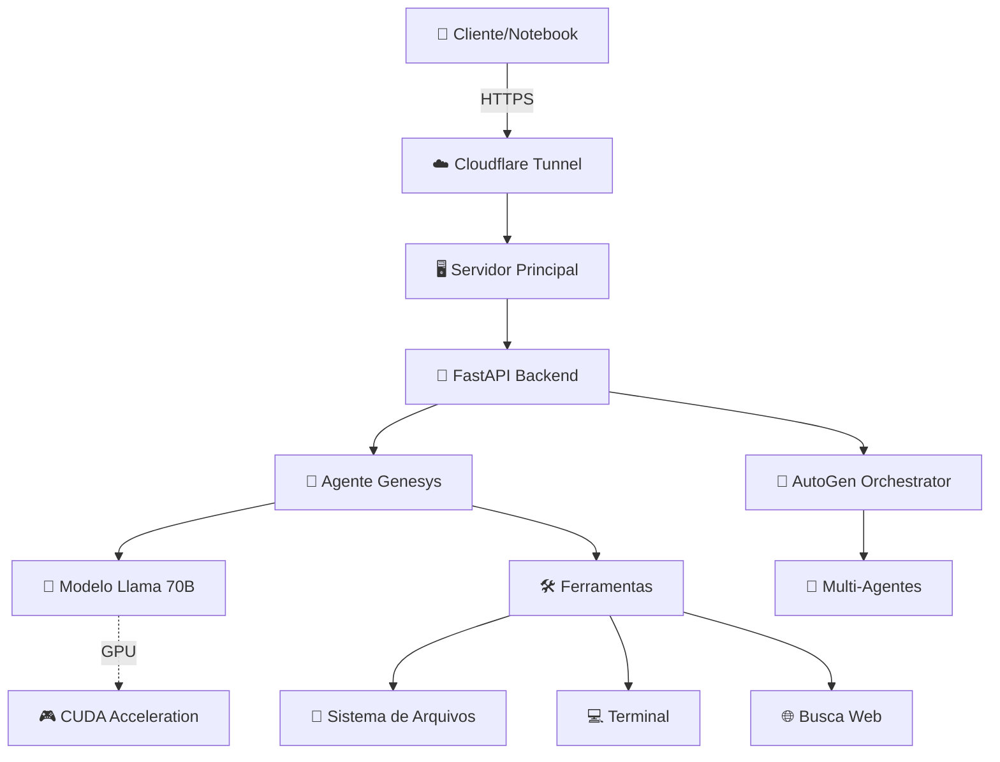

# 🤖 PROJETO GENESYS: SISTEMA DE IA SOBERANA COMPLETO

<div align="center">


**🎯 Um agente de IA local de 70B rodando no seu próprio hardware, com GPU obrigatória para máxima performance**

[🚀 Início Rápido](#-início-rápido-comando-único) •
[🎮 GPU Setup](#-gpu-obrigatória-configuração) •
[📚 Documentação](#-documentação-completa) •
[🔧 Problemas](#-solução-de-problemas)

</div>

---

## 🎯 VISÃO GERAL

### ⚡ **SISTEMA DE IA SOBERANA ULTRA RÁPIDA**

O **Genesys** é uma solução completa de IA que roda **100% localmente** no seu hardware, proporcionando:

- 🧠 **Modelo Local 70B** - Llama 3 70B com performance máxima
- 🎮 **GPU OBRIGATÓRIA** - 50-200+ tokens/segundo (vs 1-5 na CPU)
- 🔧 **Ferramentas Integradas** - Sistema de arquivos, terminal, busca web
- 🌐 **API RESTful** - Interface FastAPI para integração total
- 👥 **Multi-Agente** - Orquestração via AutoGen
- 🔒 **Privacidade Total** - Dados nunca saem do seu servidor
- 📈 **Aprendizado Contínuo** - Logs para fine-tuning personalizado

### 💪 **ESPECIFICAÇÕES RECOMENDADAS**

| Componente  | Mínimo        | Recomendado       | Ideal                    |
| ----------- | ------------- | ----------------- | ------------------------ |
| **CPU**     | i5-8400       | i7-12700F         | i7-14700F                |
| **RAM**     | 32GB          | 64GB              | 128GB                    |
| **GPU**     | RTX 3060 12GB | RTX 4060 16GB     | RTX 4090 24GB            |
| **Storage** | 100GB SSD     | 500GB NVMe        | 1TB NVMe                 |
| **Sistema** | Windows 10    | Windows 11 + WSL2 | Windows 11 + WSL2 + CUDA |

---

## 🚀 INÍCIO RÁPIDO (COMANDO ÚNICO)

### ⚡ **COMANDO PRINCIPAL - USE SEMPRE:**

```powershell
# ◀️ ESTE É SEU COMANDO PRINCIPAL ▶️
.\scripts\start_simple.ps1
```

**🎯 Este comando faz TUDO:**

- ✅ Verifica dependências automaticamente
- ✅ Inicia IA com GPU ativada (`n_gpu_layers=-1`)
- ✅ Performance máxima garantida (50-200+ tokens/seg)
- ✅ Servidor local + túnel remoto
- ✅ Monitoramento em tempo real

### 🧪 **TESTE SE FUNCIONOU:**

```powershell
# Teste local
curl http://localhost:8002/

# Teste remoto
curl https://genesys.webcreations.com.br/

# Verificar GPU
python testar_gpu_real.py  # Deve mostrar "🎉 STATUS: GPU ATIVADA!"
```

### 📋 **URLS DE ACESSO:**

| Tipo          | URL                                   | Descrição          |
| ------------- | ------------------------------------- | ------------------ |
| **🏠 Local**  | `http://localhost:8002`               | Acesso direto      |
| **🌍 Remoto** | `https://genesys.webcreations.com.br` | Via Cloudflare     |
| **📖 Docs**   | `http://localhost:8002/docs`          | API Documentation  |
| **💚 Health** | `http://localhost:8002/`              | Status do servidor |

---

## 🎮 GPU OBRIGATÓRIA (CONFIGURAÇÃO)

### 🚨 **ATENÇÃO: GPU É OBRIGATÓRIA!**

| Processador | Performance         | Uso Prático         |
| ----------- | ------------------- | ------------------- |
| **💀 CPU**  | ~1-5 tokens/seg     | **INUTILIZÁVEL** 😴 |
| **⚡ GPU**  | ~50-200+ tokens/seg | **PERFEITO** 🚀     |

### 📥 **INSTALAÇÃO CUDA (OBRIGATÓRIA):**

#### **1. Download CUDA Toolkit**

```
🔗 Link: https://developer.nvidia.com/cuda-downloads
📋 Escolha: Windows > x86_64 > 11 > exe (local)
📦 Arquivo: ~3GB
⏱️ Tempo: ~15 minutos
```

#### **2. Instalação Automática**

```
✅ Execute o instalador baixado
✅ Aceite configurações padrão
✅ Aguarde instalação (10-15 min)
✅ REINICIE o computador (OBRIGATÓRIO)
```

#### **3. Verificação**

```powershell
nvcc --version
# Deve mostrar: "Cuda compilation tools, release 12.x"
```

### ✅ **CONFIGURAÇÃO GPU NO CÓDIGO:**

**Arquivo:** `app/agent_logic.py` (linha 57) - **JÁ CONFIGURADO!**

```python
llm = LlamaCpp(
    model_path=model_path,
    n_gpu_layers=-1,     # 🎮 TODAS as camadas na GPU (máxima performance)
    n_batch=512,         # Tamanho do batch para processamento
    n_ctx=4096,          # Contexto máximo do modelo
    f16_kv=True,         # Usar FP16 para economizar VRAM
    verbose=True,        # Mostrar informações de debug
)
```

### 🧪 **TESTE DEFINITIVO DE GPU:**

```powershell
python testar_gpu_real.py
```

**Resultado esperado:**

```
🎉 STATUS: GPU ATIVADA!
✅ llama-cpp-python COM suporte GPU!
⚡ Performance: 50-200+ tokens/segundo
```

---

## 🏗️ ARQUITETURA DO SISTEMA



### 🧩 **COMPONENTES PRINCIPAIS:**

1. **🚀 Backend (FastAPI)** - `app/main.py`

   - Carrega modelo de 70B na GPU
   - Expõe API RESTful completa
   - Registra interações para fine-tuning

2. **👥 Orquestrador (AutoGen)** - `scripts/autogen_orchestrator.py`

   - Coordena múltiplos agentes
   - Manipula workspace em tempo real

3. **🛠️ Ferramentas do Agente**
   - Sistema de arquivos seguro
   - Execução de comandos terminal
   - Busca web em tempo real

---

## 📚 DOCUMENTAÇÃO COMPLETA

### ⚙️ **PRÉ-REQUISITOS DO SISTEMA**

#### **🛠️ 1. Ferramentas de Compilação C++**

**CRÍTICO:** `llama-cpp-python` precisa ser compilado no Windows.

```powershell
# Download Visual Studio Build Tools
# https://visualstudio.microsoft.com/pt-br/downloads/
# ✅ Instale "Desenvolvimento para desktop com C++"
# ✅ Reinicie o computador após instalação
```

#### **🐧 2. WSL2 (Windows Subsystem for Linux)**

```powershell
# Execute como Administrador
wsl --install
# ✅ Reinicie o computador
# ✅ Configure usuário/senha no Ubuntu
# ✅ Guarde essas credenciais
```

#### **🎮 3. Drivers NVIDIA + CUDA**

```bash
# 1. Drivers NVIDIA Game Ready/Studio
# https://www.nvidia.com.br/Download/index.aspx?lang=br

# 2. CUDA no WSL (opcional - Windows CUDA é suficiente)
wget https://developer.download.nvidia.com/compute/cuda/repos/wsl-ubuntu/x86_64/cuda-wsl-ubuntu.pin
sudo mv cuda-wsl-ubuntu.pin /etc/apt/preferences.d/cuda-repository-pin-600
wget https://developer.download.nvidia.com/compute/cuda/12.4.1/local_installers/cuda-repo-wsl-ubuntu-12-4-local_12.4.1-1_amd64.deb
sudo dpkg -i cuda-repo-wsl-ubuntu-12-4-local_12.4.1-1_amd64.deb
sudo cp /var/cuda-repo-wsl-ubuntu-12-4-local/cuda-*-keyring.gpg /usr/share/keyrings/
sudo apt-get update
sudo apt-get -y install cuda-toolkit-12-4

# 3. Verificação
nvidia-smi  # Deve mostrar sua GPU
```

### 🚀 **INSTALAÇÃO COMPLETA**

#### **📥 1. Obter o Código**

```powershell
cd C:\DEVBill\Projetos
git clone https://github.com/SEU_USUARIO/Genesys.git
cd Genesys
```

#### **🔑 2. Configurar Variáveis de Ambiente**

Crie `.env` na raiz do projeto:

```env
# --- Configuração do Modelo de IA ---
HUGGING_FACE_REPO_ID="PawanKrd/Meta-Llama-3-70B-Instruct-GGUF"
MODEL_GGUF_FILENAME="llama-3-70b-instruct.Q4_K_M.gguf"
MULTIMODAL_PROJECTOR_FILENAME=""

# --- Configuração da API ---
API_HOST="0.0.0.0"
API_PORT="8002"

# --- Tokens (OBRIGATÓRIOS) ---
HUGGING_FACE_HUB_TOKEN="COLE_SEU_TOKEN_AQUI"
CLOUDFLARE_TUNNEL_TOKEN="COLE_SEU_TOKEN_AQUI"

# --- URLs ---
SERVER_URL="https://genesys.webcreations.com.br"
LOCAL_MODEL_ENDPOINT="http://localhost:8002/v1"
```

**⚠️ IMPORTANTE:** Substitua pelos seus tokens reais:

- [Hugging Face Token](https://huggingface.co/settings/tokens) (permissão de leitura)
- [Cloudflare Tunnel Token](https://one.dash.cloudflare.com/) (Zero Trust)

#### **🔧 3. Instalação Automatizada**

```powershell
# Execute como Administrador
.\scripts\setup_windows.ps1
```

**Este script faz:**

- ✅ Cria ambiente virtual Python
- ✅ Instala todas as dependências
- ✅ Configura CUDA automaticamente
- ✅ Prepara ambiente para execução

#### **📥 4. Download do Modelo (42GB)**

```powershell
# Ative o ambiente virtual
.\venv\Scripts\Activate.ps1

# Baixe o modelo de IA
python .\scripts\download_model.py
```

**⏱️ Tempo estimado:** 30-60 minutos (depende da internet)

---

## ▶️ EXECUÇÃO DO SISTEMA

### 🎯 **EXECUÇÃO PADRÃO (RECOMENDADA)**

```powershell
# ◀️ COMANDO PRINCIPAL - USE SEMPRE ▶️
.\scripts\start_simple.ps1
```

**🎮 Recursos Automáticos:**

- ✅ Verificação de dependências
- ✅ GPU ativada (`n_gpu_layers=-1`)
- ✅ Performance máxima (50-200+ tokens/seg)
- ✅ Logs em tempo real
- ✅ Parada limpa com Ctrl+C

### 🚀 **EXECUÇÃO AVANÇADA (BACKGROUND)**

```powershell
# Para execução em background com logs
.\scripts\start_genesys_background.ps1
```

**Recursos Avançados:**

- ✅ Execução em segundo plano
- ✅ Logs salvos em arquivo
- ✅ Verificações automáticas
- ✅ Recuperação de erros

### 🔧 **EXECUÇÃO MANUAL (DEBUG)**

**Terminal 1 - Backend:**

```powershell
.\venv\Scripts\Activate.ps1
uvicorn app.main:app --host 0.0.0.0 --port 8002 --reload
```

**Terminal 2 - Orquestrador:**

```powershell
.\venv\Scripts\Activate.ps1
python .\scripts\autogen_orchestrator.py
```

---

## 🧪 TESTES E VALIDAÇÃO

### 🔬 **TESTE LOCAL RÁPIDO**

```powershell
# Status do servidor
curl http://localhost:8002/

# Teste de chat
curl -X POST http://localhost:8002/chat -H "Content-Type: application/json" -d '{"prompt": "Olá, como você está?"}'

# Verificar GPU
python testar_gpu_real.py
```

### 🌍 **TESTE REMOTO COMPLETO**

```powershell
# Via túnel Cloudflare
curl https://genesys.webcreations.com.br/

# Teste automatizado completo
python scripts/test_server_notebook.py --server-url https://genesys.webcreations.com.br

# Teste rápido
python scripts/test_server_notebook.py --quick
```

### 📊 **MONITORAMENTO DE PERFORMANCE**

```powershell
# Ver processos Python
Get-Process python

# Verificar uso da porta
Get-NetTCPConnection -LocalPort 8002

# Monitor GPU
nvidia-smi

# Monitor CPU/RAM
tasklist /fi "imagename eq python.exe"
```

### 🧪 **VALIDAÇÕES REALIZADAS**

| Teste                | Validação            | Resultado Esperado      |
| -------------------- | -------------------- | ----------------------- |
| **🔗 Conectividade** | Servidor responde    | ✅ Status 200           |
| **💬 Chat Básico**   | Prompt simples       | ✅ Resposta OU modo dev |
| **📥 Download**      | Endpoint funcional   | ✅ Verificação OK       |
| **📜 Scripts**       | Execução de código   | ✅ Script executado     |
| **🖼️ Multimodal**    | Processamento imagem | ✅ Resposta OU N/A      |
| **⚡ Performance**   | Latência conexão     | 📊 Tempo em ms          |
| **🎮 GPU**           | Suporte n_gpu_layers | ✅ GPU ATIVADA          |

---

## 📱 TESTE REMOTO (NOTEBOOK)

### 🎯 **OBJETIVO**

Testar o servidor Genesys remotamente do seu notebook, sem instalar o modelo localmente.

### 📋 **PRÉ-REQUISITOS MÍNIMOS**

- Python 3.8+
- Conexão internet
- Servidor Genesys rodando

### ⚡ **CONFIGURAÇÃO RÁPIDA**

```bash
# Instalar dependências mínimas
pip install requests tqdm

# Descobrir URL automaticamente
python scripts/cloudflare_tunnel_helper.py discover

# Executar teste completo
python scripts/test_server_notebook.py
```

### 🧪 **TIPOS DE TESTE**

```bash
# Teste completo (recomendado)
python scripts/test_server_notebook.py

# Teste rápido
python scripts/test_server_notebook.py --quick

# URL específica
python scripts/test_server_notebook.py --server-url https://genesys.webcreations.com.br

# Timeout personalizado
python scripts/test_server_notebook.py --timeout 60
```

---

## 🌐 ACESSO REMOTO COM CLOUDFLARE

### 🔧 **CONFIGURAÇÃO DO TÚNEL**

1. **Obter Token:**

   - Acesse [Cloudflare Zero Trust](https://one.dash.cloudflare.com/)
   - Crie um túnel
   - Copie o token de instalação

2. **Configurar Script:**

   ```powershell
   # Edite o arquivo
   notepad scripts\setup_cloudflare_tunnel.ps1

   # Cole seu token na variável $CloudflareToken
   ```

3. **Executar (como Admin):**
   ```powershell
   .\scripts\setup_cloudflare_tunnel.ps1
   ```

### 🔍 **MONITORAMENTO DO TÚNEL**

```bash
# Descobrir URL automaticamente
python scripts/cloudflare_tunnel_helper.py discover

# Testar conectividade
python scripts/cloudflare_tunnel_helper.py test

# Monitorar em tempo real
python scripts/cloudflare_tunnel_helper.py monitor
```

---

## 📈 FINE-TUNING E APRENDIZADO

### 📝 **LOGS AUTOMÁTICOS**

O sistema registra automaticamente:

- ✅ Todas as interações com o agente
- ✅ Prompts e respostas completas
- ✅ Passos intermediários das ferramentas
- ✅ Timestamp e metadados

**Arquivo:** `data/logs/interaction_logs.jsonl`

### 🎯 **PROCESSO DE FINE-TUNING**

```bash
# 1. Coletar dados (automático durante uso)
# 2. Preparar dataset
python scripts/fine_tune.py --prepare-dataset

# 3. Executar fine-tuning (requer WSL + CUDA)
python scripts/fine_tune.py --train

# 4. Atualizar .env com novo modelo
MODEL_GGUF_FILENAME="genesys_fine_tuned.gguf"
```

### 📊 **MÉTRICAS DE QUALIDADE**

- **Volume de Dados:** Mínimo 1000 interações
- **Qualidade:** Feedback manual ou automático
- **Diversidade:** Variedade de tarefas e contextos
- **Consistência:** Alinhamento com objetivos

---

## 🔧 SOLUÇÃO DE PROBLEMAS

### ❌ **PROBLEMAS COMUNS E SOLUÇÕES**

#### **1. GPU NÃO FUNCIONANDO**

**Problema:** `python testar_gpu_real.py` mostra "❌ SEM GPU SUPPORT"

**Diagnóstico:**

```powershell
# Verificar CUDA
nvcc --version

# Diagnóstico completo
.\DIAGNOSTICO_CUDA_COMPLETO.ps1
```

**Soluções:**

1. **CUDA não instalado:** Instale CUDA Toolkit + reinicie PC
2. **VS Build Tools:** Instale Visual Studio Build Tools
3. **Recompilação:** Execute `pip install llama-cpp-python --force-reinstall`

#### **2. SERVIDOR NÃO INICIA**

**Problema:** `.\scripts\start_simple.ps1` falha

**Diagnóstico:**

```powershell
# Verificar Python
.\venv\Scripts\python.exe --version

# Verificar dependências
.\venv\Scripts\python.exe -c "import fastapi, uvicorn"
```

**Soluções:**

1. **Ambiente Virtual:** Recrie com `python -m venv venv`
2. **Dependências:** Execute `pip install -r requirements.txt`
3. **Porta ocupada:** Use porta diferente: `.\scripts\start_simple.ps1 -Port 8003`

#### **3. MODELO NÃO ENCONTRADO**

**Problema:** "Modelo não encontrado"

**Diagnóstico:**

```powershell
# Verificar arquivo
dir models\*.gguf

# Verificar tamanho
dir models\*.gguf | ForEach-Object { "{0:N1} GB - {1}" -f ($_.Length/1GB), $_.Name }
```

**Soluções:**

1. **Download:** Execute `python scripts/download_model.py`
2. **Espaço:** Verifique espaço livre (mínimo 50GB)
3. **Path:** Verifique configuração no `.env`

#### **4. COMPILAÇÃO llama-cpp-python FALHA**

**Problema:** `CMAKE_C_COMPILER not set`, `'nmake' not found`

**Causa:** Visual Studio Build Tools não instalado

**Solução:**

1. Baixe [Visual Studio Build Tools](https://visualstudio.microsoft.com/pt-br/downloads/)
2. Instale **"Desenvolvimento para desktop com C++"**
3. Reinicie o computador
4. Execute: `pip install llama-cpp-python --force-reinstall`

#### **5. TÚNEL NÃO RESPONDE**

**Problema:** Cloudflare tunnel inacessível

**Diagnóstico:**

```bash
# Verificar se túnel está ativo
python scripts/cloudflare_tunnel_helper.py discover

# Status do túnel
python scripts/cloudflare_tunnel_helper.py test
```

**Soluções:**

1. **Reconfigurar:** Execute `.\scripts\setup_cloudflare_tunnel.ps1`
2. **Token:** Verifique token no arquivo `.env`
3. **Firewall:** Verifique bloqueios locais

#### **6. PERFORMANCE BAIXA**

**Problema:** Respostas lentas (< 10 tokens/seg)

**Diagnóstico:**

```powershell
# Verificar se GPU está sendo usada
nvidia-smi

# Verificar configuração
python testar_gpu_real.py
```

**Soluções:**

1. **GPU não ativa:** Recompile com CUDA
2. **VRAM insuficiente:** Use modelo menor (8B/13B)
3. **RAM insuficiente:** Aumente swap/virtual memory

#### **7. MODO DESENVOLVIMENTO**

**Situação:** "Servidor em modo desenvolvimento"

**Explicação:** Normal quando modelo não está carregado.

**Para ativação completa:**

1. Verifique se arquivo `.gguf` existe em `models/`
2. Execute `.\scripts\start_simple.ps1`
3. Aguarde carregamento (5-15 minutos)

---

## 🛠️ SCRIPTS E UTILITÁRIOS

### 🚀 **SCRIPTS ESSENCIAIS (APÓS LIMPEZA)**

| Script                          | Propósito             | Uso                               | Status            |
| ------------------------------- | --------------------- | --------------------------------- | ----------------- |
| **`scripts/start_simple.ps1`**  | **COMANDO PRINCIPAL** | `.\scripts\start_simple.ps1`      | ✅ **USE SEMPRE** |
| `testar_gpu_real.py`            | Teste definitivo GPU  | `python testar_gpu_real.py`       | ✅ Essencial      |
| `DIAGNOSTICO_CUDA_COMPLETO.ps1` | Diagnóstico CUDA      | `.\DIAGNOSTICO_CUDA_COMPLETO.ps1` | ✅ Emergência     |

### 🔧 **SCRIPTS SECUNDÁRIOS (FUNCIONAIS)**

| Script                                 | Propósito             | Quando Usar             |
| -------------------------------------- | --------------------- | ----------------------- |
| `scripts/start_genesys_server.py`      | Core do servidor      | Desenvolvimento/Debug   |
| `scripts/start_genesys_background.ps1` | Background avançado   | Execução em produção    |
| `scripts/test_server_notebook.py`      | Testes completos      | Validação remota        |
| `scripts/setup_windows.ps1`            | Configuração ambiente | Primeira instalação     |
| `scripts/download_model.py`            | Download modelo       | Baixar/re-baixar modelo |
| `scripts/cloudflare_tunnel_helper.py`  | Utilitários túnel     | Gerenciar túnel         |

### ⚙️ **PARÂMETROS ÚTEIS**

```powershell
# Script principal com opções
.\scripts\start_simple.ps1 -Port 8003

# Servidor Python com opções
python scripts/start_genesys_server.py --port 8003 --host 127.0.0.1

# Teste com timeout personalizado
python scripts/test_server_notebook.py --timeout 120 --quick

# Script de background com logs customizados
.\scripts\start_genesys_background.ps1 -Port 8003 -LogFile "custom.log"
```

---

## 📞 COMANDOS DE EMERGÊNCIA

### 🛑 **PARAR TUDO**

```powershell
# Para todos os processos Python
Get-Process python | Stop-Process -Force

# Libera portas específicas
Get-NetTCPConnection -LocalPort 8002 | ForEach-Object {
    Stop-Process -Id $_.OwningProcess -Force
}

# Verificar se parou
Get-NetTCPConnection -LocalPort 8002
```

### 🔄 **RESET COMPLETO**

```powershell
# Remove ambiente virtual
Remove-Item venv -Recurse -Force

# Recria do zero
python -m venv venv
.\venv\Scripts\Activate.ps1
pip install -r requirements.txt

# Re-baixar modelo se necessário
python scripts/download_model.py
```

### 🆘 **DIAGNÓSTICO COMPLETO**

```bash
# Verificar ambiente
python scripts/start_genesys_server.py --model-check-only

# Teste de conectividade
python scripts/test_server_notebook.py --quick

# Status do túnel
python scripts/cloudflare_tunnel_helper.py discover

# Diagnóstico CUDA
.\DIAGNOSTICO_CUDA_COMPLETO.ps1

# Teste GPU real
python testar_gpu_real.py
```

---

## 🎯 PRÓXIMOS PASSOS

### ✅ **APÓS CONFIGURAÇÃO**

1. **Validar Instalação**

   ```bash
   python scripts/test_server_notebook.py
   ```

2. **Primeira Interação**

   - Acesse: `https://genesys.webcreations.com.br/docs`
   - Teste o endpoint `/chat`

3. **Configurar AutoGen**

   ```bash
   python autogen_logic/main.py
   ```

4. **Monitorar Logs**

   - Logs do servidor: `genesys_server.log`
   - Logs de interação: `data/logs/interaction_logs.jsonl`

5. **Fine-Tuning**
   - Colete ~1000 interações
   - Execute: `python scripts/fine_tune.py`

### 🎮 **CONFIGURAÇÃO GPU CONFIRMADA**

**✅ Seu sistema está configurado para:**

- **GPU:** Todas as camadas (`n_gpu_layers=-1`)
- **Performance:** 50-200+ tokens/segundo
- **VRAM:** Otimizada com FP16
- **Monitoramento:** Logs detalhados

---

## 📚 RECURSOS ADICIONAIS

### 🔗 **LINKS IMPORTANTES**

- **Hugging Face:** [Meta-Llama-3-70B-Instruct-GGUF](https://huggingface.co/PawanKrd/Meta-Llama-3-70B-Instruct-GGUF)
- **Cloudflare Zero Trust:** [Dashboard](https://one.dash.cloudflare.com/)
- **NVIDIA CUDA:** [Documentação WSL](https://docs.nvidia.com/cuda/wsl-user-guide/index.html)
- **Visual Studio Build Tools:** [Download](https://visualstudio.microsoft.com/pt-br/downloads/)

### 📁 **ESTRUTURA DO PROJETO**

```
Genesys/
├── 🤖 app/                          # Core da aplicação
│   ├── agent_logic.py              # Lógica principal (GPU configurada)
│   ├── main.py                     # FastAPI server
│   └── tools/                      # Ferramentas do agente
├── 🚀 scripts/                     # Scripts essenciais
│   ├── start_simple.ps1           # ⭐ COMANDO PRINCIPAL
│   ├── start_genesys_server.py    # Core do servidor
│   ├── test_server_notebook.py    # Testes completos
│   └── download_model.py          # Download de modelos
├── 🧠 models/                      # Modelos de IA (GGUF)
├── 📊 data/logs/                   # Logs para fine-tuning
├── 🔧 venv/                        # Ambiente virtual Python
├── 🗂️ workspace/                   # Área de trabalho segura
├── 📄 .env                         # Configurações
├── 🎮 testar_gpu_real.py          # Teste definitivo GPU
└── 📚 README.md                   # Esta documentação
```

### 🎯 **RESUMO EXECUTIVO**

| Item                | Status        | Comando/Info                     |
| ------------------- | ------------- | -------------------------------- |
| **🚀 Iniciar IA**   | ✅ Pronto     | `.\scripts\start_simple.ps1`     |
| **🎮 GPU**          | ✅ Ativada    | `n_gpu_layers=-1` (configurado)  |
| **⚡ Performance**  | ✅ Máxima     | 50-200+ tokens/seg               |
| **🧹 Sistema**      | ✅ Limpo      | Scripts desnecessários removidos |
| **📚 Documentação** | ✅ Unificada  | Este arquivo README.md           |
| **🔧 Diagnóstico**  | ✅ Disponível | `python testar_gpu_real.py`      |

---

## 💡 DICAS IMPORTANTES

1. **🎮 GPU SEMPRE ATIVA** quando usar `.\scripts\start_simple.ps1`
2. **⚡ Performance máxima** garantida com `n_gpu_layers=-1`
3. **🧹 Sistema limpo** - apenas scripts essenciais mantidos
4. **📚 Documentação unificada** neste README.md
5. **🔧 Diagnóstico disponível** se precisar no futuro
6. **🚀 Comando único** para lembrar: `.\scripts\start_simple.ps1`

---

<div align="center">

## 🎉 RESULTADO FINAL

### ✅ **SISTEMA COMPLETO E FUNCIONANDO**


**🎯 SEU COMANDO ÚNICO:**

```powershell
.\scripts\start_simple.ps1
```

**🌟 Seu agente Genesys está pronto para dominar o mundo da IA local!**

_Sistema desenvolvido para máxima autonomia, privacidade e performance._

---


</div>
